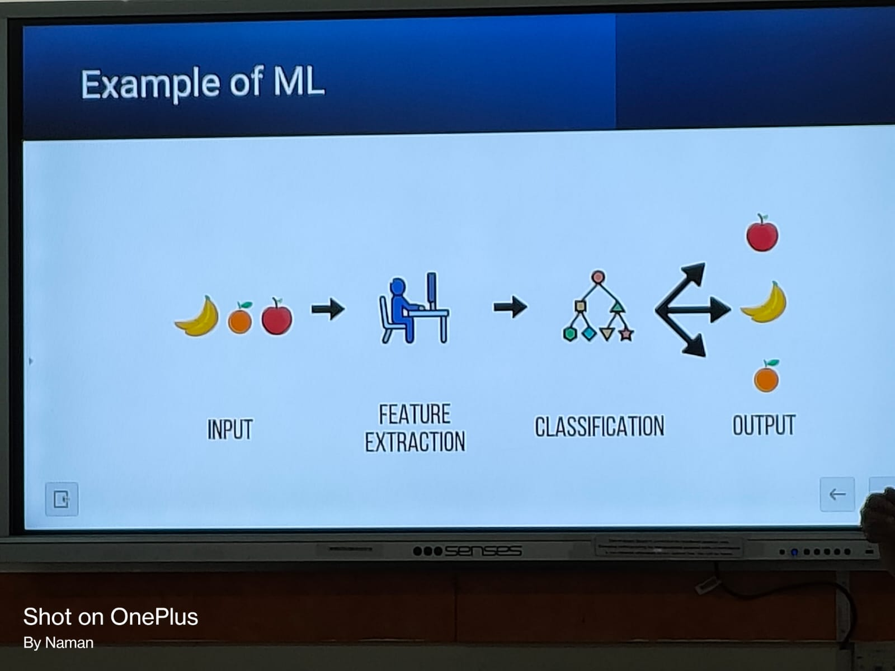

# Introduction to Artificial Intelligence #

## What is AI? ##

- AI means to implement the intellignece in a man made device such that it can perform the tasks which are normally performed by human beings.
- AI is created using algorithms and statistics.
- John McCarthy coined the term AI in 1956.
- John McCarthy stated that AI is the branch of computer science that creates intelligent machines that work and react like humans.

`The theory and development of computer systems able to perform tasks normally requiring human intelligence, such as visual perception, speech recognition, decision-making, and translation between languages.`

AI includes following specializations:

- Game Playing
- Expert System
- Natural Language Processing
- Neural Networks
- Robotics

## Why is AI blooming nowdays? ##

AI is blooming nowdays because of the following reasons:

    - Increase in the amount of data.
    - Increase in the amount of computational power.
    - Increase in the amount of storage capacity.
    - Increase in the amount of cloud computing.
    - Increase in the amount of open source libraries.
    - Increase in the amount of research in the field of AI.

## Types of AI ##

AI is classified into two types:

- `Strong AI`: they are of two types - Unsupervised ML and Supervised ML
- `Weak AI`: they are supervised ML

## AI vs ML vs DL ##

- `AI`: AI is the science of training machines to perform human tasks.
- `ML`: ML is a subset of AI that is based on the idea that machines should be able to learn and adapt through experience.
- `DL`: DL is a subset of ML that is based on the idea of artificial neural networks.

## Example of AI ##

## What is ML ##

*Machine Learning* is an application of artificial intelligence (AI) that provides systems the ability to automatically learn and improve from experience without being explicitly programmed. Machine learning focuses on the development of computer programs that can access data and use it to learn for themselves.

<!-- ## What is DL ##

*Deep Learning* is a subset of machine learning in artificial intelligence (AI) that has networks capable of learning unsupervised from data that is unstructured or unlabeled. Also known as deep neural learning or deep neural network. -->

## What is Supervised ML ##

*Supervised* Learning is the machine learning task of learning a function that maps an input to an output based on example input-output pairs. It infers a function from labeled training data consisting of a set of training examples.

## What is Unsupervised ML ##

*Unsupervised* Learning is a type of machine learning algorithm used to draw inferences from datasets consisting of input data without labeled responses. The most common unsupervised learning method is cluster analysis, which is used for exploratory data analysis to find hidden patterns or grouping in data.

## What is Reinforcement Learning ##

*Reinforcement* Learning is an area of machine learning concerned with how software agents ought to take actions in an environment in order to maximize the notion of cumulative reward. Reinforcement learning is one of three basic machine learning paradigms, alongside supervised learning and unsupervised learning.

## Limitations of ML ##

- Are not useful while working with high demensional data, that is where we have large number of inputs and outputs.
- Cannot solve crucial AI problems like NLP, Image recognition etc.
- Cannot solve problems where we have to take decisions based on the past experiences.
