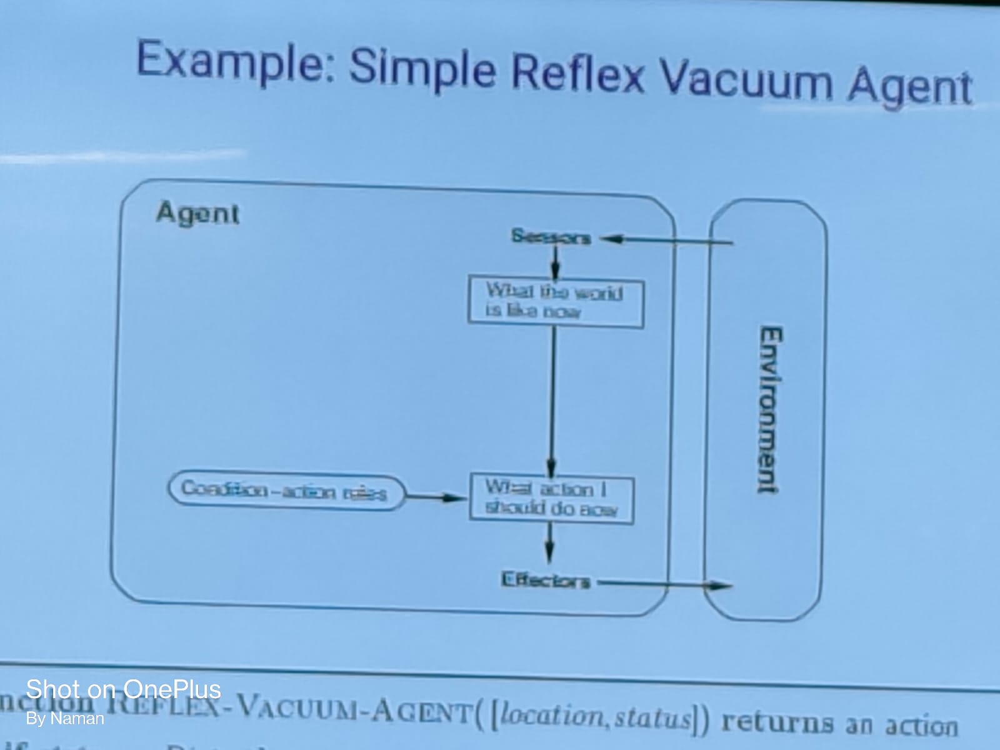

# Overview of AI #

## Table of Contents ##

- Part-1
- History and Introduction to AI
- Intelligent Agent
- Types of Agents
- Environment and Types
- Typical AI Problems

## What is AI? ##

- Artificial Intelligence is concerned with the design of intelligence in an artificial device.

`There are two ideal definitions of AI:`

- The study of the computations that make it possible to perceive, reason, and act.
- The study of how to make computers do things at which, at the moment, people are better.

## Goals of AI ##

- To create expert systems which exhibit intelligent behavior with the capability to learn, demonstrate, explain and advice its users.
- To implement human intelligence in machines.

## AI Foundations ##

- Mathematics: Logic, Probability, Statistics, Calculus, Algebra, Graph Theory, etc.
- Computer Science: Algorithms, Data Structures, Programming Languages, etc.
- Linguistics: Syntax, Semantics, Pragmatics, etc.
- Psychology: Perception, Emotion, Learning, etc.
- Philosophy: Mind, Consciousness, etc.

## AI Feilds ##

- Speech Recognition
- Natural Language Processing
- Computer Vision
- Robotics
- Expert Systems
- Machine Learning
- Neural Networks
- Fuzzy Logic

## The Turing Test ##

`IMPORTANT`

- The Turing Test is a test of a machine's ability to exhibit intelligent behavior equivalent to, or indistinguishable from, that of a human.
- The test was introduced by Alan Turing in his 1950 paper "Computing Machinery and Intelligence," which he called the "imitation game."
- The test is named after Alan Turing, the founder of computer science.

## History of AI ##

- 1943: McCulloch and Pitts proposed a model of artificial neurons.
- 1951: Marvin Minsky built the first neural network computer, SNARC.
- 1956: John McCarthy coined the term "Artificial Intelligence" at the Dartmouth Conference.
- 1952-1969: Early AI programs, including Samuel's checkers program, Newell and Simon's Logic Theorist, Gelernter's Geometry Engine.
- 1969-1979: Early development of knowledge-based systems, including MYCIN, DENDRAL, and others.
- 1980: The first commercial expert system, R1, introduced by Digital Equipment Corporation.
- 1985: The emergence of the connectionist approach to AI, including the introduction of the back-propagation learning algorithm.
- 1988: The emergence of the probabilistic approach to AI, including the introduction of the belief network.

## AI Applications ##

- Gaming
- Natural Language Processing
- Expert Systems
- Vision Systems
- Speech Recognition
- Handwriting Recognition
- Intelligent Robots
- Neural Networks
- Heuristic Classification
- Intelligent Computer-Aided Instruction
- Medical Diagnosis

## Intelligent Agent ##

- An intelligent agent is an autonomous entity which observes through sensors and acts upon an environment using actuators and directs its activity towards achieving goals.

| Agent | Environment |
| ----- | ----------- |
| Robot | Room |
| Chatbot | Chatting |
| Veichle | Road |
| Program | Data and Rules |
| Machine | Working Feild |

`Examples:`

1. `Human Agent:` Eyes, Ears, and Other Organs are sensors and Hands, Legs, Mouth, and Other Body Parts are actuators.
2. `Robotic Agent:` Cameras, Temperature Sensors, and Other Sensors are sensors and Motors, Lights, and Other Actuators are actuators.
3. `Software Agent:` Keyboard, Mouse, and Other Input Devices are sensors and Monitor, Printer, and Other Output Devices are actuators.

`Agent Terminology:`

- Performance Measure of Agent: It is the criteria which determines how successful an agent is.
- Behaviour of Agent: It is the action taken by the agent in response to a given sequence of percepts.
- Percept: It is the agent's perceptual inputs at any given instant.
- Percept Sequence: It is the complete history of everything the agent has ever perceived.
- Agent Function: It maps any given percept sequence to an action.

`What is an Intelligent Agent:` It is an agent which is capable of perceiving its environment and acting accordingly to achieve its goals.

- It is an autonomous entity which observes through sensors and acts upon an environment using actuators and directs its activity towards achieving goals.
- Fundamental Facilities of an Intelligent Agent: It should be reactive, proactive, social, and goal-oriented.
- Goal: Design rational agents that do a "Good Job" of acting in their environments.

`What is a Rational Agent:`

- It is an agent which always selects an action that is expected to maximize its performance measure, given the evidence provided by the percept sequence and whatever built-in knowledge the agent has.
- AI is about building rational agents.
- An agent should strive to "do the right thing," based on what it knows and what it perceives.
- An agent is something that perceives and acts in an environment.
- A rational agent is one that does the right thing.

`Perfect Rationality:` It is the ideal concept of rationality in which the agent always selects the action that maximizes its performance measure, given its percept sequence.

`Bounded Rationality:` It is the concept of rationality in which the agent selects the action that it believes will maximize its performance measure, given the evidence provided by the percept sequence and the built-in knowledge the agent has.

## PEAS Analysis ##

- PEAS stands for Performance Measure, Environment, Actuators, and Sensors.
- To design a rationa agent, we must specify the task environment in which it will operate by defining PEAS.

| Example | Performance Measure | Environment | Actuators | Sensors |
| ------- | ------------------- | ----------- | --------- | ------- |
| Medical Diagonisis System | Healthy Patient, Low Cost | Hospital, Patient | Screen, Keyboard | Keyboard, Patient |
| Part-Picking Robot | Percentage of Parts Correctly Picked | Factory, Conveyor Belt, Bins, Boxes | Jointed Arm, Suction Gripper | Camera, Joint Angle Sensors, Joint Angle Sensors |

`Question:` To design a rational agent, we must specify the task environment. Consider, e.g., the task of designing an Self Driving Car:

| Example | Performance Measure | Environment | Actuators | Sensors |
| ------- | ------------------- | ----------- | --------- | ------- |
| Self Driving Car | Safe, Comfortable, Profitable | Roads, Other Traffic, Pedestrians, Customers | Steering Wheel, Accelerator, Brake, Signal, Horn | Cameras, Sonar, Speedometer, GPS, Gyro, Engine Sensors |

`Question:` To design a rational agent, we must specify the task environment. Consider, e.g., the task of designing an Online Shopping Agent:

| Example | Performance Measure | Environment | Actuators | Sensors |
| ------- | ------------------- | ----------- | --------- | ------- |
| Online Shopping Agent | Cheap, Correct | Internet, Customer, Seller | Browser, Keyboard, Mouse | Keyboard, Mouse, Screen, Internet |

## Environment ##

- The environment is the task environment in which the agent operates.

There are two types of environments:

1. `Fully Observable Environment:` An environment in which the agent's sensors give it access to the complete state of the environment at each point of time.
2. `Partially Observable Environment:` An environment in which the agent's sensors give it access to only partial state of the environment at each point of time.

There are diffrent types of partially observable environments:

1. `Deterministic Environment:` An environment in which the next state of the environment is completely determined by the current state and the action executed by the agent.
2. `Stochastic Environment:` An environment in which the next state of the environment is not completely determined by the current state and the action executed by the agent.
3. `Episodic Environment:` An environment in which the agent's experience is divided into atomic episodes. Each episode consists of the agent perceiving and then performing a single action. The next episode does not depend on the actions taken in previous episodes.
4. `Sequential Environment:` An environment in which the agent's experience is divided into atomic episodes. Each episode consists of the agent perceiving and then performing a single action. The next episode depends on the actions taken in previous episodes.
5. `Static Environment:` An environment in which the environment does not change while an agent is deliberating.
6. `Dynamic Environment:` An environment in which the environment changes while an agent is deliberating without any interference from the agent.
7. `Discrete Environment:` An environment in which the number of possible percepts and actions is finite.
8. `Continuous Environment:` An environment in which the number of possible percepts and actions is infinite.
9. `Complete Environment:` An environment in which the agent has complete knowledge of the environment and its properties.
10. `Incomplete Environment:` An environment in which the agent does not have complete knowledge of the environment and its properties.
11. `Single Agent Environment:` An environment in which only one agent is operating.
12. `Multi Agent Environment:` An environment in which multiple agents are operating.

**Examples:**

- Crossword Puzzle:

1. Fully Observable Environment
2. Deterministic Environment
3. Episodic Environment
4. Single Agent Environment

- Chess:

1. Fully Observable Environment
2. Deterministic Environment
3. Sequential Environment
4. Single Agent Environment

- Self Driving Car:

1. Partially Observable Environment
2. Stochastic Environment
3. Sequential Environment
4. Dynamic Environment
5. Continuous Environment
6. Incomplete Environment
7. Mult Agent Environment

- Medical Diagnosis System:

1. Partially Observable Environment
2. Stochastic Environment
3. Sequential Environment
4. Static Environment
5. Discrete Environment
6. Incomplete Environment
7. Single Agent Environment

## Types of Agents ##

- There are diffrent types of agents:

1. `Simple Reflex Agent:` It selects actions on the basis of the current percept, ignoring the rest of the percept history.
2. `Model Based Reflex Agent:` It selects actions on the basis of the current percept and the percept history.
3. `Goal Based Agent:` It selects actions on the basis of the current percept, the percept history, and the goal.
4. `Utility Based Agent:` It selects actions on the basis of the current percept, the percept history, the goal, and the utility function.
5. `Learning Agent:` It selects actions on the basis of the current percept, the percept history, the goal, the utility function, and the learning algorithm.

### Simple Reflex Agent ###

- We can summarize part of the table by fromulating commonly occuring patterns as condition-action rules.

E.g., if car-in-front-brakes then initiate braking.

- Agent works by finding rule whose condition matches the current situation.
- But, this only works if the current percept is sufficient for making the correct decision.

*Disadvantages:*

- Very limited intelligence.
- No knowledge of non-perceptual parts of the state.
- Usually too big to generate and store.
- If there occurs any change in the environment, then the collection of rules needs to be updated.

### Model Based Reflex Agent ###

- Updating internal state requires two kinds of encoded knowledge:

1. knowledge about how the world changes (independent of the agent's actions)
2. knowedge about how the agent's actions affect the world.

- But, knowledge of the internal state is not always enough:

1. how to choose among alternative decision paths(e.g., where should the car go at an intersection?)
2. requires knowledge of the goal to be acheived.

