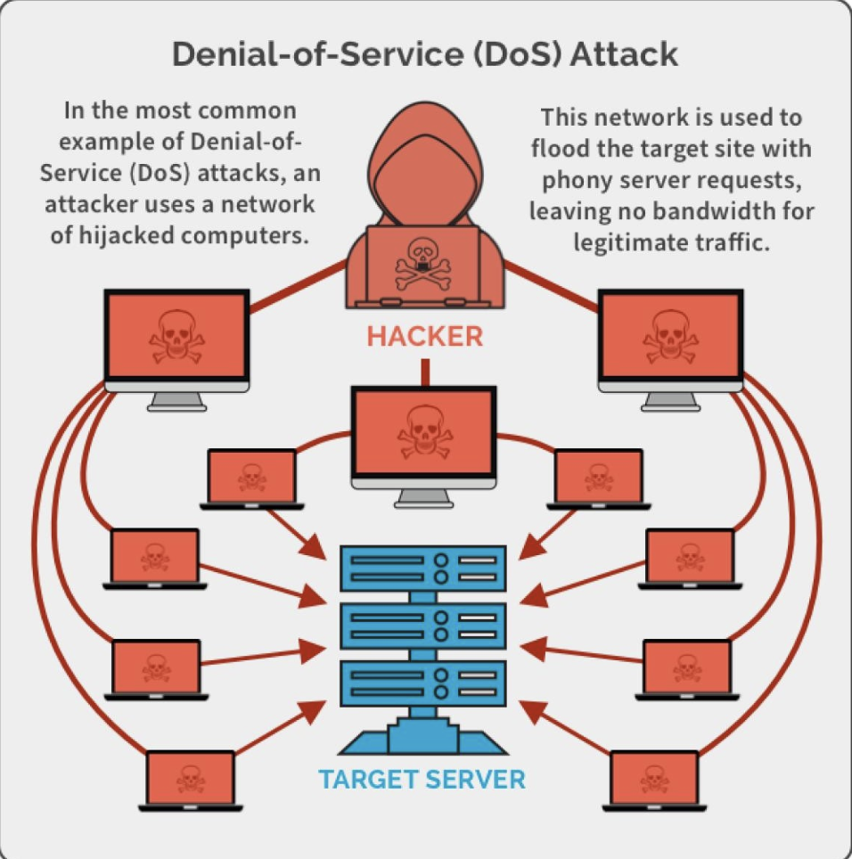

# Importance of Cybersecurity

1. **Protection of Sensitive Data:** Cybersecurity safeguards valuable data, such as personal information, financial records, and intellectual property, from theft and unauthorized access.

2. **Preservation of Privacy:** It helps maintain individual and organizational privacy, ensuring that personal and confidential information remains secure.

3. **Business Continuity:** Cybersecurity measures prevent disruptions to business operations, minimizing downtime and financial losses caused by cyberattacks.

4. **Prevention of Financial Loss:** Effective cybersecurity safeguards against financial losses resulting from theft, fraud, or ransomware attacks.

5. **National Security:** Cybersecurity is critical for protecting a nation's critical infrastructure and sensitive government information from cyber threats.

6. **Reputation Management:** A strong cybersecurity posture helps maintain trust and reputation among customers, partners, and stakeholders.

7. **Compliance with Regulations:** It ensures compliance with data protection and privacy regulations, avoiding legal and financial penalties.

8. **Prevention of Cybercrime:** Cybersecurity measures deter cybercriminals and discourage illegal online activities.

9. **Protection of End Users:** Cybersecurity safeguards end users from cyber threats, such as malware, phishing, and identity theft.

The internet allows attacker to work from anywhere on the planet.

Risks caused by poor security knowledge and practices:

- Identity Theft
- Monetary Theft
- Legal Consequences (for yourself or your organization) sacntions or termination is policies are not followed.

The top vectors of vulnerabilities available to a cyber criminal are:

- Web Browsers
- IM Clients
- Web Applications

 `Cyber security refers to the body of technologies, processes,  and practices designed to protect networks, devices,  programs, and data from attack, damage, or unauthorized  access.`

In simpler terms, cybersecurity is like a shield of technology, methods, and rules that are put in place to keep your computer networks, devices, software, and information safe from being harmed, stolen, or accessed by people who shouldn't have permission. It's all about making sure your digital stuff stays secure and out of the hands of bad guys.

**Cyber Security is Saftey:**

*Security:* We must protect our computers and data in the  same way that we secure the doors to our homes.
*Saftey:* We must behave in ways that protect us against risks  and threats that come with technology.

## What is a Secure System? (CIA Triad)

1. Confidentiality: restrict acess to authorised individuals.
2. Integrity: data has not been altered in any unauthorised manner.
3. Availability: Availability ensures that data and resources are accessible and usable when needed.

## Threats and Vulnerabilities

*Threats:* Any circumstances or events that can  potentially harm an information system by  destroying it, disclosing the information  stored on the system, adversely modifying  data, or making the system unavailable. `Anything that could hurt a computer system by breaking it, revealing its secrets, changing its information, or making it stop working.`
*Vulnerabilities:* Weakness in an information system or its components that could be exploited.`A weak point in a computer system or its parts that can be taken advantage of.`

## What kinds of threats are there?

- *Social Engineering Scams:* `Social engineering scams` involve manipulative tactics to trick people into revealing confidential information or performing actions they shouldn't. These scams often rely on psychological manipulation and may include impersonation, phishing emails, or deceptive phone calls. The goal is to exploit human behavior to gain unauthorized access or extract sensitive data.

- *Common Malware and Ransomware:* `Malware`, short for "malicious software," is a type of software specifically designed to harm or exploit computer systems. It includes viruses, worms, Trojans, and spyware. Malware can damage files, steal data, or control a computer without the user's consent.`Ransomware` is like a digital thief that locks your computer files and asks for money to unlock them. Paying the thief is risky and doesn't guarantee your files back, so it's best to prevent it.

- *Business Email Compromise:* `Business Email Compromise (BEC)` is like a trick where a scammer pretends to be someone important, like your boss or a colleague, through email. They might ask you to send money or confidential information. It's important to double-check with the person in person or over the phone if you receive any unusual money requests in an email.

## Phishing

**Phishing** is a cybercrime technique where attackers use deceptive emails, messages, or websites to trick individuals into revealing personal information, such as usernames, passwords, credit card details, or social security numbers. These deceptive communications often appear to be from trusted sources, like banks, social media platforms, or government agencies, creating a false sense of urgency or importance to prompt the victim into taking action.

**Common Phishing Techniques**:

1. **Email Phishing**: Attackers send fraudulent emails that imitate legitimate sources, often containing links to fake websites or malicious attachments.

2. **Spear Phishing**: A more targeted approach where cybercriminals customize their phishing attempts for specific individuals or organizations, using information gathered about the target.

3. **Vishing (Voice Phishing)**: Instead of emails, scammers use phone calls to trick victims into revealing sensitive information or making unauthorized payments.

4. **Smishing (SMS Phishing)**: Similar to email phishing, but via text messages. Victims are lured into clicking on links or responding to messages with personal data.

**Red Flags for Identifying Phishing**:

- `Generic Greetings`: Phishing emails often use generic greetings like "Dear User" or "Valued Customer."
- `Urgency`: Scammers create a sense of urgency, pressuring victims to act quickly.
- `Suspicious Links`: Hover over links to see the actual URL before clicking. Be cautious of misspelled domains or unusual URLs.
- `Unsolicited Attachments`: Don't open attachments from unknown sources.
- `Requests for Personal Information`: Legitimate organizations typically won't ask for sensitive data via email.

**Preventing Phishing**:

- `Be cautious`: Question the authenticity of unexpected emails or messages.
- `Verify`: If in doubt, verify the sender's identity through an independent and trusted source.
- `Keep Software Updated`: Ensure your operating system, browsers, and security software are up to date to prevent exploitation of vulnerabilities.
- `Educate`: Learn about phishing tactics and raise awareness among colleagues and family members.

Phishing is a prevalent and continually evolving threat in the digital world. Staying informed and adopting safe online practices is crucial to defend against it.

## Social Engineering

**Social Engineering** is a manipulation technique used by cybercriminals to deceive people into revealing confidential information or performing actions that they shouldn't, often by pretending to be someone they trust.

`When attempting to steal information or a  person’s identity, a hacker will often try to trick you into giving out sensitive information rather than breaking into your computer.`

Social Engineering can often take place:

- Over the Phone
- By text Messages
- Instant Messages
- Emails
- etc.

## Malware

`Malware = Malicious Software`

`Malware` is any kind of unwanted software that is installed without your consent on your computer and other digital devices.

There are various subgroups of malware, including:

- `Viruses`: A virus is a type of malware that can replicate itself and spread to other computers. It can damage files, steal data, or control a computer without the user's consent.
- `Worms`: A worm is a type of malware that can replicate itself and spread to other computers. It can damage files, steal data, or control a computer without the user's consent.
- `Trojan Horses:` A Trojan horse is a type of malware that can disguise itself as legitimate software. It can damage files, steal data, or control a computer without the user's consent.
- `Spyware`: Spyware is a type of malware that can secretly monitor and collect information about a user's online activity without their knowledge or consent.
- `Ransomware`: Ransomware is a type of malware that can encrypt files on a computer and demand a ransom to unlock them. Paying the ransom is risky and doesn't guarantee that the files will be decrypted.
- `Adware`: Adware is a type of malware that can display unwanted advertisements on a computer. It can also collect information about a user's online activity without their knowledge or consent.
- `Bombs:` A bomb is a type of malware that can delete files or damage a computer's hardware. It can also cause a computer to crash or become unresponsive.

## Viruses

**Viruses** are like digital germs. They're small, harmful programs that can sneak into your computer or device and cause problems, like stealing your data or damaging your files. To stay safe, use antivirus software and be careful about what you download or click on.

Types of Viruses:

- `Direct Infection:` Viruses can infect files every time a user opens that specific infected program, document, or file.
- `Fast Infection:` It is when a virus infects any file that is accessed by the program that is infected.
- `Slow Infection:` It is when the virus infects any new or modified program, file, or document.
- `Sparse Infection:` It is the process of randomly infecting files, etc. on the computer.
- `RAM Resident Infection:` It is when the infection buries itself in your Computer’s Random Access Memory.

`Sparse Infection` and `RAM Resident Infection` are the most trickiest viruses as the can easily trick the antivirus softwares present in our systems.

## Bombs

**Bombs** are like digital explosives. They're small, harmful programs that can sneak into your computer or device and cause problems, like stealing your data or damaging your files.

- `Logic Bombs:` programming code that is designed to execute or explode when a certain condition is reached.
- Most of the time it goes off when a certain time is reached or a program fails to execute. But these bombs wait for a triggered event to happen.
- The most common use of this is in the `financial/business` world.
- Most IT employees call this the `disgruntled employee syndrome`.

## Trojans

- `Trojan horse`: a program or software designed to look like a useful or legitimate file.
- Once the program is installed and opened it steals information or deletes data.
- Trojan horses compared to other types of malware are that it usually runs only once and then are done functioning.
- Some create back-door effects
- Another distribution of Trojans is by infecting a server that hosts websites.
- The downfall of Trojans: very reliant on the user. `When we say "The downfall of Trojans: very reliant on the user," it means that Trojans, a type of malicious software, can only work if a person is tricked into running or opening them. Unlike viruses or worms that can spread on their own, Trojans need human interaction to cause harm. This reliance on the user's actions is a weakness of Trojans because it's easier to protect your computer from them by being cautious about what you download and open.`

## Worms

**Worms** are like digital parasites that can spread on their own. They're small, self-replicating programs that move from one computer to another, usually through networks. Worms can slow down or harm your computer, and they often do so without needing any action from you. So, they're like the "germs" of the digital world.

Types of Worms:

**User Propagation Worms:** User propagation worms are a type of computer worm that rely on human actions or social engineering to spread. They don't have the capability to self-replicate. Instead, they trick users into running or spreading them. For example, a user may receive an email with an infected attachment and, if they open the attachment, the worm can spread to other users in their contact list.

**Self-Propagation Worms:** Self-propagation worms, on the other hand, are computer worms that can spread independently without human intervention. They can exploit vulnerabilities in computer systems or networks to copy themselves and infect other computers. Unlike user propagation worms, they are more autonomous and do not rely on human actions to propagate.

**Email Worms:** are a type of malware that primarily spreads through email messages. They often use infected email attachments or links to malicious websites to propagate. When a user opens the infected email attachment or clicks on a malicious link, the worm can infiltrate the user's computer and then use the user's email contacts to further spread itself. An example of an email worm is the "ILOVEYOU" worm that spread via email in 2000.

**Internet Worms:** are a broader category of malware that spread over the internet, typically through network vulnerabilities or weaknesses. Unlike email worms, they don't rely on email as their primary propagation method. Internet worms can exploit vulnerabilities in operating systems, software, or network devices to replicate and move from one computer to another across the internet. The "Blaster" worm that targeted Windows systems in 2003 is an example of an internet worm. These worms can spread rapidly and cause widespread damage if not mitigated.

## Zombie & Botnet

**Zombie** is a computer that has been infected by a virus or worm and can be controlled remotely by an attacker. The attacker can use the zombie to send spam, launch denial-of-service attacks, or steal data.

**Botnet** is a network of zombie computers that are controlled by an attacker. The attacker can use the botnet to send spam, launch denial-of-service attacks, or steal data.

### Zombies

- In the context of cybersecurity, a "zombie" refers to a computer or device that has been infected by malware, often without the knowledge or consent of the device owner.
- These infected devices are typically controlled remotely by a malicious actor, forming part of a larger network.
- Zombies can be used for various malicious purposes, such as sending spam, conducting distributed denial of service (DDoS) attacks, or participating in other cybercrimes.
- Users of infected devices may not be aware that their machine is compromised, as the malware operates stealthily.

### Botnets

- A "botnet" is a network of compromised computers or devices (zombies) under the control of a central command (botmaster).
- Botnets are usually created for illegal or malicious activities, such as launching coordinated cyberattacks, distributing malware, or stealing data.
- The combined computing power of the botnet allows it to carry out tasks on a much larger scale than an individual computer.
- Botnet owners can issue commands to the network, making it a potent tool for cybercriminals.
- To protect against botnets, security measures like updated antivirus software, firewalls, and intrusion detection systems are essential. Additionally, user education and safe online practices are crucial in preventing devices from becoming zombies in botnets.

## Adware & Spyware

**Adware** is like a digital ad that won't leave you alone. It's a type of software that shows you a lot of unwanted ads, often in a very annoying way. Adware can slow down your computer and can be quite intrusive.

- **Nature of Adware:** Adware, short for `advertising-supported software,` is a type of software that displays advertisements on a user's device. These ads can be in the form of pop-ups, banners, or auto-playing videos.
- **Common Sources:** Adware often comes bundled with free software or apps, and users may unknowingly install it when downloading legitimate programs.
- **Impact:** While not typically as harmful as malware, adware can be annoying and intrusive, disrupting the user experience. It may also slow down the device's performance.
- **Revenue Model:** Adware developers generate income through ad clicks and views, and they may share this revenue with the creators of free software that carries their adware.
- **Prevention and Removal:** Adware can be prevented by being cautious about what you download and install. It can be removed using reputable antivirus or anti-adware software.

**Spyware**, on the other hand, is like a digital spy. It's a sneaky program that secretly watches what you do on your computer and can steal your personal information, like passwords and credit card numbers, without you knowing. It's a serious invasion of privacy and can be harmful.

- **Nature of Spyware:** `Spyware` is malicious software designed to covertly collect information about a user's online activities, such as web browsing habits, login credentials, and personal information.
- **Stealthy Nature:** Spyware operates in the background, often without the user's consent or knowledge, making it a significant invasion of privacy.
- **Malicious Intent:** The collected data is typically sent to a remote server and can be used for various purposes, including identity theft, fraud, or targeted advertising.
- **Distribution:** Spyware can be distributed through deceptive downloads, email attachments, or compromised websites.
- **Prevention and Removal:** Protecting against spyware involves using reputable antivirus and anti-spyware software, being cautious about downloads, and practicing safe internet browsing habits.

## Exploit Kits

**Exploit Kit:**

- An **exploit kit** is a malicious software package or toolkit used by cybercriminals to automate the process of finding and exploiting vulnerabilities in software, web browsers, or operating systems on a victim's computer.
- Exploit kits often target known security weaknesses, taking advantage of unpatched software or outdated systems.
- When a user visits a compromised website or clicks on a malicious link, the exploit kit scans their system for vulnerabilities. If it finds a weakness, it delivers malware (such as viruses, Trojans, or ransomware) to the victim's device.
- These kits are designed to streamline the process of infecting computers and are frequently used for delivering various types of cyberattacks, including theft of personal information, financial fraud, and spreading malware.
- Protecting against exploit kits involves keeping software and systems up-to-date with security patches, using reputable antivirus software, and practicing safe internet browsing to avoid visiting potentially compromised websites.

## Identity Theft

**Identity Theft:**

- **Nature of Identity Theft:** Identity theft is a form of cybercrime where someone fraudulently acquires and uses another person's personal information, such as their name, social security number, credit card details, or financial accounts, without their consent.
- **Methods of Theft:** Identity thieves can obtain this information through various means, including data breaches, phishing scams, hacking, or even stealing physical documents.
- **Criminal Activities:** Once in possession of this stolen identity, criminals can engage in a wide range of fraudulent activities, including opening new lines of credit, making unauthorized purchases, or committing financial fraud.
- **Impact:** Identity theft can lead to financial losses, damage to an individual's credit history, and even legal consequences if the victim is wrongly associated with criminal activities.
- **Prevention and Protection:** Protecting against identity theft involves safeguarding personal information, using strong and unique passwords, regularly monitoring financial statements, and being cautious about sharing sensitive data online.

## Denial of Service Attack (DoS)

**Denial of Service (DoS) Attack:**

- **Nature of DoS Attack:** A Denial of Service (DoS) attack is a malicious attempt to disrupt the normal functioning of a computer system, network, website, or online service by overwhelming it with an excessive volume of traffic.
- **Objective:** The primary goal of a DoS attack is to render the target system unavailable to its users, causing disruption and inconvenience.
- **Methods:** DoS attacks can be executed through various means, including flooding the target with network traffic, exploiting vulnerabilities to crash a service, or overloading server resources.
- **Distributed Denial of Service (DDoS):** In a Distributed Denial of Service (DDoS) attack, multiple compromised devices, often part of a botnet, are used to amplify and distribute the attack traffic, making it more challenging to mitigate.
- **Impact:** DoS attacks can lead to financial losses, damage to an organization's reputation, and loss of user trust. They can be disruptive and may affect critical services or websites.
- **Mitigation:** Protecting against DoS attacks involves implementing security measures, such as firewalls, intrusion detection systems, and load balancing, to filter out malicious traffic and maintain service availability.

## Ransomware

**Ransomware:**

- **Nature of Ransomware:** Ransomware is a type of malicious software designed to encrypt a victim's files, making them inaccessible. The attacker then demands a ransom payment, usually in cryptocurrency, in exchange for the decryption key.
- **Delivery Methods:** Ransomware can be delivered through various means, including infected email attachments, malicious downloads, or exploiting software vulnerabilities. Social engineering is often used to trick victims into activating the ransomware.
- **Encryption:** Ransomware uses strong encryption techniques, making it nearly impossible for victims to access their files without the decryption key, which is held by the attacker.
- **Impact:** Ransomware can lead to data loss, financial harm, and disruption of critical services. Paying the ransom is discouraged as it does not guarantee the safe return of files and may support criminal activities.
- **Prevention and Mitigation:** Protecting against ransomware involves regularly backing up data, using strong and updated antivirus software, keeping software and operating systems up to date, and educating users about the risks of suspicious downloads and emails.

**Ransomware Controls:**

- Weapons-Grade Data Backups
- Relegious Patch Management
- Plan to Fail Well (Incident Response Plan)

## Business/Official Email Compromise

**Business Email Compromise (BEC):**

- **Nature of BEC:** Business Email Compromise is a type of cybercrime where attackers use deceptive emails to impersonate high-ranking individuals within an organization, like the CEO or CFO, or trusted external partners, such as vendors or clients.
- **Objective:** The primary goal of BEC is to manipulate recipients into taking unauthorized actions, such as transferring money, sharing sensitive data, or making financial transactions, under the false belief that they are following legitimate instructions.
- **Methods:** Attackers may use tactics like social engineering, email spoofing, or phishing to craft convincing emails that appear to come from trusted sources.
- **Variants:** BEC can take various forms, including CEO Fraud (impersonating company executives), Vendor Email Compromise (posing as vendors to alter payment details), and Lawyer Email Compromise (fraudulent legal requests).
- **Impact:** BEC can lead to significant financial losses, data breaches, and damage to an organization's reputation. It is a growing concern for businesses worldwide.
- **Prevention and Mitigation:** Preventing BEC involves implementing security measures like email authentication protocols (e.g., DMARC), user training on recognizing phishing attempts, verification of financial requests through multiple channels, and establishing strong internal controls for financial transactions.

## Cyber Crime

`Cyber Crime` is a generic term that refers to all criminal activities done using the medium of communication devices,  computers, mobile phones, tablets, etc.

It can be categorized  in three ways:

- The computer as a target – attacking the computers of others.
- The computer as a weapon- Using a computer to commit `traditional crime` that we see in the physical world.
- The computer as an accessory- Using a computer as a “fancy filing cabinet” to store illegal or stolen information.

The most common types of cyber crimes are:

- Identity Theft
- Botnets
- Cyber Stalking
- Social Engineering
- Flood Attacks
- Potentially Unwanted Programs
- Exploit Kits
- Phishing Attacks
- Illegal Content
- Online Scams

## Cyber Criminals

Types of Cyber Criminals:

- The Social Engineer
- The Spear Phisher
- The Hacker
- The Rouge Employee
- The Ransom Aritst

## Hacking

Types of thefts using hacking:

- Financial (theft,  fraud, blackmail)
- Political/State (state  level/military)
- Fame/Kudos  (fun/status)
- Hacktivism (cause)
- Pen Testers (legal  hacking)
- Police
- Insider
- Business

## Network Attacks

Common Types of Network Attacks:

1. Unatuthorised Access: `Unauthorized access` is a type of network attack where an attacker gains access to a network or system without authorization. It can be achieved through various means, including exploiting vulnerabilities, social engineering, or using stolen credentials. Unauthorized access can lead to data breaches, financial losses, and disruption of critical services.
2. Distributed Denial of Service (DDoS) attacks: Attackers build botnets, large fleets of compromised devices, and use them to direct false traffic at your network or servers. `DDoS` can occur at the network level, for example by sending huge volumes of `SYN/ACC packets` which can overwhelm a server, or at the application level, for example by performing `complex SQL queries` that bring a database to its knees.
3. Man in the middle attacks: A `man-in-the-middle attack` involves attackers intercepting traffic, either between your network and external sites or within your network.
4. Code and SQL injection attacks: Many websites accept user inputs and fail to validate and sanitize those inputs. Attackers can then fill out a form or make an API call, passing malicious code instead of the expected data values. The code is executed on the server and allows attackers to compromise it.
5. Privilege Escalation: Once attackers penetrate your network, they can use privilege escalation to expand their reach. Horizontal privilege escalation involves attackers gaining access to additional, adjacent systems, and vertical escalation means attackers gain a higher level of privileges for the same systems.
6. Insider Threats: A network is especially vulnerable to malicious insiders, who already have privileged access to organizational systems. Insider threats can be difficult to detect and protect against because insiders do not need to penetrate the network in order to do harm.

## Ethical Hacking

`Ethical hacking` involves an authorized attempt to gain unauthorized access to a computer system, application, or data. Carrying out an ethical hack involves duplicating the strategies and actions of malicious attackers. This practice helps to identify security vulnerabilities which can then be resolved before a malicious attacker can exploit them.

## Cyber Crime as Services

`Cybercrime as a Service` is a type of business model that enables cybercriminals to purchase or rent cybercrime tools and services. It allows even non-technical users to launch cyberattacks with minimal effort and expertise.

Types of Cybercrime as a Services are:

- *Spoofing:* Spoofing is a type of cybercrime where an attacker impersonates a legitimate user or device to gain unauthorized access to a network or system. It can be used to launch various types of cyberattacks, including phishing, malware distribution, and denial-of-service attacks.
- *Tampering:* Tampering is a type of cybercrime where an attacker modifies data or systems without authorization. It can be used to steal data, disrupt services, or cause other types of damage.
- *Repudiation:* Repudiation is a type of cybercrime where an attacker denies performing an action or transaction. It can be used to evade responsibility for malicious activities, such as financial fraud or data theft.
- *Non-Repudiation:* Non-repudiation is a type of cybercrime where an attacker cannot deny performing an action or transaction. It can be used to prove that a user performed a specific action, such as sending an email or making a financial transaction.
- *Privilege Escalation:* Privilege escalation is a type of cybercrime where an attacker gains unauthorized access to a higher level of privileges. It can be used to gain access to sensitive data or perform malicious activities.

## Global Cybersecurity Trends - The Next Wave

Recent Studies reveal three major findings:

- *Growing threat to national security:* web espionage becomes  increasingly advanced, moving from curiosity to well-funded and  well-organized operations aimed at not only financial but also  political or technical gain
web espionage becomes  increasingly advanced, moving from curiosity to well-funded and  well-organized operations aimed at not only financial but also  political or technical gain
- *Increasing Threat to online services:* affecting individuals and  industry because of the growth of sophistication of attack techniques
- *Emergence of a sophisticated market for software flaws:* that can be used to carry out espionage and attacks on Govt. and  Critical information infrastructure. Findings indicate a blurred line  between legal and illegal sales of software vulnerabilities
- `Mischievous activities in cyberspace have expanded from novice  geeks to organized criminal gangs that are going Hi-tech`

Other Key Threat detection strategies include:

- *Penetration Testing:* By thinking the way, a cybercriminal would, security experts can scan their IT environments for vulnerabilities, such as unpatched software, authentication errors, and more.
- *Automated Monitoring System:* Alongside manual processes, organizations can enhance their cybersecurity by integrating automated threat detection systems. These platforms can help organizations by tracking device performance and activity, monitoring web traffic, and notifying the cybersecurity team when irregularities are detected.
- *User Behaviour analytics:* By analyzing user behavior, an organization can better understand what normal behavior for an employee would look like. This includes the kind of data they access, the time of day during which they log on, and their physical location. That way, any outlying behavior will stand out as unusual, and it will be easier for a security analyst to know what behavior to investigate.

## How to Identify Threats

- *Identify the mysterious Emails:* Email phishing is preferred by malicious attackers to access sensitive business information by pretending to be a trusted organization or website. Users must be careful to click on unknown mail.
- *Identify suspicious pop-ups:* Users avoid clicking on all the pop-ups. Unknown pop-ups may be infected with malware and spyware.
- *Report on slower than a normal network:* Hacking attempts or malware outbreaks often result in spikes in a network that can reduce the internet speed.
- *Keep software up-to-date:* Currently updated software can reduce the
Likelihood attack.  

**Mitigating Threats:** It is about doing things to make it harder to take advantage of a threat. Requiring passwords to control who can log in mitigates the threat of spoofing. Adding password controls that enforce complexity or expiration makes it less likely that a password will be guessed or usable if stolen.

**Eliminating Threats:** It is almost always achieved by eliminating features. If you have a threat that someone will access the administrative function of a website by visiting the `/admin/URL`, you can mitigate it with passwords or other authentication techniques, but the threat is still present. You can make it less likely to be found by using a URL like `/j8e8vg21euwq/`, but the threat is still present. You can eliminate it by removing the interface and handling administration through the command line.

**Transferring Threats:** It is about letting someone or something else handle the risk. For example, you could pass authentication threats to the operating system, or trust boundary enforcement to a firewall product. You can also transfer risk to customers, for example, by asking them to click through lots of hard-to-understand dialogs before they can do the work they need to do.

**Accepting the Risk:** It is about doing nothing. If you have a threat that someone will access the administrative function of a website by visiting the `/admin/URL`, you can accept the risk and do nothing.

## Network Protection Best Practices

- *Segregate your Networks:* A basic part of avoiding network security threats is dividing a network into zones based on security requirements. This can be done using subnets within the same network, or by creating Virtual Local Area Networks (VLANs), each of which behaves like a separate network. Segmentation limits the potential impact of an attack on one zone and requires attackers to take special measures to penetrate and gain access to other network zones.
- *Regualate Access to the Internet via Proxy Server:* Do not allow network users to access the Internet unchecked. Pass all requests through a transparent proxy,  and use it to control and monitor user behavior. Ensure that outbound connections are performed by a human and not a bot or other automated mechanism. Whitelist domains to ensure corporate users can only access websites you have explicitly approved.
- *Place Security Devices Correctly:* Place a firewall at every junction of `network zones`, not just at the network edge. If you can’t deploy `full-fledged firewalls` everywhere, use the `built-in firewall` functionality of your switches and routers. Deploy `anti-DoS devices` or cloud services at the network edge. Carefully consider where to place strategic devices like `load balancers` – if they are outside the `Demilitarized Zone (DMZ),` they won’t be protected by your network security apparatus.
- *Use Network Address Translation:* Network Address Translation (NAT) lets you translate internal IP addresses into addresses accessible on public networks.
- *Monitor Network Traffic:* Ensure you have complete visibility of incoming, outgoing, and internal network traffic, with the ability to automatically detect threats, and understand their context and impact.
- *Use Deception Technology:* No network protection measures are 100% successful, and attackers will eventually succeed in penetrating your network. Recognize this and place deception technology in place, which creates decoys across your network, tempting attackers to `attack` them, and letting you observe their plans and techniques.

**Diffrent ways to address IP Spoofing includes:**

1. Do not reveal any information regarding your internal IP addresses. This helps prevent those addresses from being `spoofed`.
2. Monitor incoming IP packets for signs of IP spoofing using network monitoring software. One popular product is `Netlog`, is alongside similar products, seeks incoming packets to the external interface that have both source and destination IP addresses in your local domain. This essentially means an incoming packet that claims to be from inside the network is coming from outside your network. Finding one means that an attack is underway.

**Address Data Tampering:**

- Protect the integrity and authenticity of critical log data directly at the source.
- Implement an immutable data notarization and verification platform based on blockchain technology.
- Detect malicious data on a fine `granular level`, allowing you to sort out only bad data.
- Provide data integrity verification and history for `SOC/SIEM, external auditors, and forensic analysis`.
- Data tampering detection can be combined with application data to directly secure critical business processes.

**Address the Repudiation:**

Nonrepudiation is achieved through cryptography, like digital signatures, and includes other services for authentication, auditing, and logging. In online transactions, digital signatures ensure that a party cannot later deny sending information or deny the authenticity of its signature.

**Address DDOS attacks:**

1. Using `firewalls` and `intrusion detection systems` to monitor network traffic and block suspicious activity.
2. Limiting the number of `requests` or `connections` that can be made to a `system` or `network`.
3. Using `load balancers` and `distributed systems` to distribute traffic across multiple `servers` or `networks`.
4. Implementing `network segmentation` and `access controls` to limit the impact of a `DoS attack`.

**Information Discloser:**

- Disclosure of information weakness in web applications to learn important data about a web application's expected shortcomings and utilize that data to make a more fruitful hack attack.

**Address information discloser:**

- Check that your web server does not send reaction headers or foundation information that reveal particulars about the backend innovation's thoughtful adaptation or design.
- Guarantee that none of the administrations utilizing the server's open ports give data about their fabricates or forms.
- On all web servers, administrations, and applications, ensure that the proper access controls and approvals are set up to forestall access for assailants.
- If a web application fizzles with no specialized data being accounted for in the blunders, guarantee that all exemptions are taken care of appropriately.
- Never hardcode login subtleties, API keys, IP addresses, or some other delicate information into the code, not even in that frame of mind of remarks. This incorporates first and last names.
- Ensure your web server is set up with the appropriate MIME types for every one of the many documents that you use in your web applications.
- Never transfer delicate material to a web server, including records, delicate information, or whatever else that is not required.
- Continuously check that each solicitation to make, change, view, or eliminate assets have the right access limitations set up to keep away from honor-heightening issues and guarantee that any delicate information is kept like that.
- To confound aggressors, ensure that your web application accurately handles client info and that a conventional reaction is constantly provided for every single one of the assets that do not exist or are forbidden.
- The backend code ought to execute adequate approvals to deal with all special cases and stop the deficiency of important information.
- Design the webserver to stifle any emerging exemptions and return a nonexclusive mistake page.
- Ensure that the web application generally shows a default site page and debilitate registry posting on the web server.

## Business E-mail Compromise Best Practices

- Avoid using free web-based email for business.
- Not only less-professional, but easier to hack, typosquat, or spoof.
- Domains and email addresses are cheap, especially  compared to BEC.
- Register similar domains to yours to prevent  typosquatting e.g. delaplex.com vs. delapelx.com.
- Be careful about the information you share on  your website or Social Media (LinkedIn, Facebook) about job duties or positions, especially for positions with transactional or purchasing authority.
- Think through Out of Office email responders.

## Vulnerability Scanner

- Functions of Vulnerability Scanner are far different  from firewall or intrusion detection system.
- Vulnerability scanning tools helps you in protecting  your organization from any kind of security risks or  threats by scanning with deep inspection of  endpoints to ensure that they are configured securely  and correctly.
- The prime aim of running a vulnerability scanner is to  identify the devices that are open for vulnerabilities.

**Types of vulnerability scanners:**

- Port scanner
- Network vulnerability scanner
- Web application security scanner
- Database security scanner.
- Host based vulnerability scanner
- ERP security scanner.
- Single vulnerability tests.

## Virus Detection

**Simple Anti-virus Scanners:**

- Look for signatures (fragments of known virus code)
- Heuristics for recognizing code associated with viruses
- Example: polymorphic viruses often use decryption loops
- Integrity checking to detect file modifications
- Keep track of file sizes, checksums, keyed HMACs of contents

**Generic decryption and emulation:**

- Emulate CPU execution for a few hundred instructions, recognize known  virus body after it has been decrypted
- Does not work very well against viruses with mutating bodies and viruses
not located near beginning of infected executable
