# Unit 2

## Threat Modelling

### What is Threat Modelling?

Threat modelling is a process by which potential threats, such as structural vulnerabilities or the absence of appropriate safeguards, can be identified, enumerated, and mitigations can be prioritized.

### Why Threat Modelling?

Threat modelling is a process that helps you identify potential threats to your application and then make decisions to mitigate them. It is a structured approach that enables you to identify, quantify, and address the security risks associated with an application.

### Threat Modelling Process

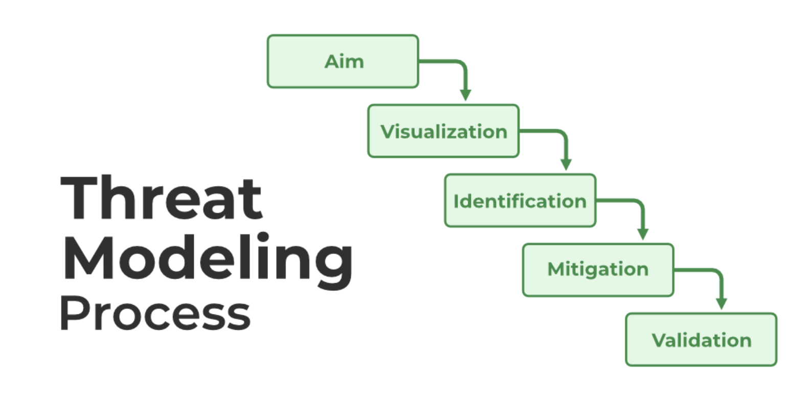

Certainly, here's an explanation of the steps in the threat modeling process:

**1. Aim:**

- The first step in threat modeling is to define the `goal` or `purpose` of the modeling process. It involves understanding what you want to `achieve` with threat modeling for your `system` or `project`. This step sets the `scope` and `objectives` of the threat modeling process.
- The Aim must follow the `CIA`. `Confidentiality`, `Integrity`, and `Availability`.

**2. Visualization:**

- Visualization involves creating a `detailed diagram` or `representation` of the `system` or `application` you are analyzing. This visualization helps in understanding the system's `components, data flows, interactions, and boundaries.` It's a crucial step in providing a clear overview of the system.

We documnet the overview in two ways:

<!-- @todo: learn DFD and PFD. -->

- `Data Flow Diagrams (DFD)`: It helps us show how the data flows through the system.
- `Process Flow Diagrams (PFD)`: It helps in finding the process of the system from where users interact in the system, and how the system works internally.

**3. Identification:**

- In the identification step, `potential threats` and `vulnerabilities` are identified within the system based on the visualization. This includes recognizing `security weaknesses, entry points for attackers, and the types of sensitive data` that need protection.

**4. Mitigation:**

- Once `threats` and `vulnerabilities` are identified, the mitigation step involves `developing strategies` and `countermeasures` to address these security concerns. This includes `implementing security controls, best practices, and changes to the system's design` to reduce the risk of exploitation.

**5. Validation:**

- Validation is the final step, where the effectiveness of the proposed mitigation measures is assessed. It involves `testing` and `verifying` that the security measures are correctly implemented and that they adequately address the identified `threats` and `vulnerabilities`. Validation ensures that the system's security is in line with the objectives set in the first step.

## Threat Modelling Methodologies

### STRIDE

STRIDE is a threat modeling methodology developed by Microsoft for identifying and categorizing threats found in software systems. It is a mnemonic for `Spoofing, Tampering, Repudiation, Information disclosure, Denial of service, and Elevation of privilege`.

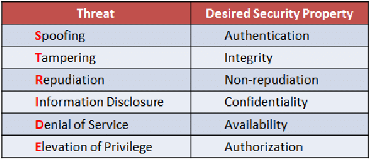

### DREAD

DREAD is a threat modeling methodology developed by Microsoft for identifying and categorizing threats found in software systems. It is a mnemonic for `Damage potential, Reproducibility, Exploitability, Affected users, and Discoverability`.

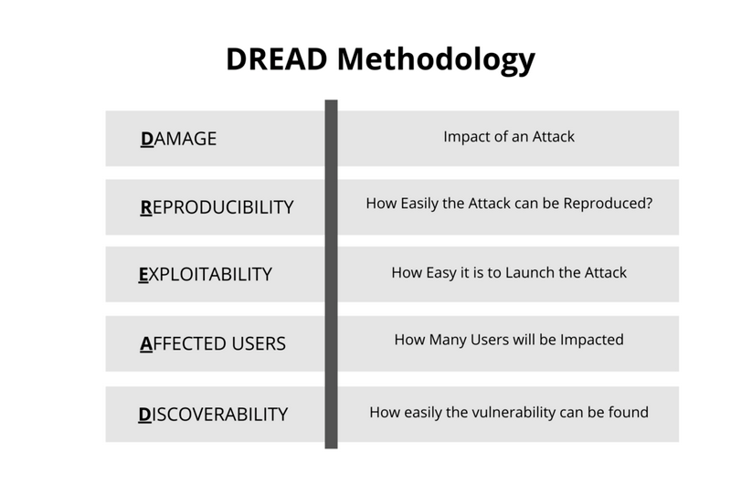

### Process for Attack Simulation and Threat Analysis (PASTA)

PASTA is a threat modeling methodology developed by OWASP for identifying and categorizing threats found in software systems. It is a mnemonic for `Process for Attack Simulation and Threat Analysis`.

### Trike

Trike is a threat modeling methodology developed by OWASP for identifying and categorizing threats found in software systems. It is a mnemonic for `Threats Requiring Innovative Knowledge-based Engineering`.

### VAST

VAST is a threat modeling methodology developed by OWASP for identifying and categorizing threats found in software systems. It is a mnemonic for `Visual, Agile, and Simple Threat modeling`.

### Attack Trees

Attack trees are a threat modeling methodology developed by Bruce Schneier for identifying and categorizing threats found in software systems. It is a mnemonic for `Attack Trees`.

**Process/Steps of the working of Attack Trees:**

1. **Identify What You Want to Protect:** Determine the most valuable assets or objectives for your organization. For instance, in a financial institution, it might be the email server.

2. **Ways to Reach the Objective:** Figure out how someone might try to access that objective. In the case of the email server, it could involve methods like credential theft.

3. **Build Paths:** Create different paths or scenarios an attacker could follow to reach the objective. Some paths might be more likely than others.

4. **Assign Likelihood:** Give each path a likelihood value (like likely or unlikely) based on research or knowledge. Likely paths are the ones that have a higher chance of happening.

5. **Assign Numeric Values:** Assign numeric values (like time or cost) to each path to determine which one is the most at-risk or likely to be used by an attacker.

6. **Plan for Protection:** Based on your analysis, decide how to protect your assets. For example, if phishing is likely, you might invest in email security software or training to prevent phishing attacks.

### Common Vulnerability Scoring System (CVSS)

CVSS is a threat modeling methodology developed by FIRST for identifying and categorizing threats found in software systems. It is a mnemonic for `Common Vulnerability Scoring System`.

### T-Map

T-Map is a threat modeling methodology developed by OWASP for identifying and categorizing threats found in software systems. It is a mnemonic for `Threat Modeling for Applications`.

## Tools for Threat Modelling

### Microsoft Threat Modelling Tool

The Microsoft Threat Modeling Tool is a core element of the Microsoft Security Development Lifecycle (SDL). The Microsoft Threat Modeling Tool 2016 is a tool that helps in finding threats in the design phase of software projects. It is available as a free download from the Microsoft Download Center.

### MyAppSecurity

MyAppSecurity is a threat modeling tool that helps in finding threats in the design phase of software projects. It uses a VAST threat classification scheme and it is based on a Process Flow Diagram (PFD), which provides a detailed view of the risks and vulnerable loopholes.

### IriuRisk

IriuRisk is a threat modeling tool that helps in finding threats in the design phase of software projects. It uses a STRIDE threat classification scheme and it is based on a Data Flow Diagram (DFD), which provides a detailed view of the risks and vulnerable loopholes.

### securiCAD

securiCAD is a threat modeling tool that helps in finding threats in the design phase of software projects. It uses a STRIDE threat classification scheme and it is based on a Data Flow Diagram (DFD), which provides a detailed view of the risks and vulnerable loopholes.

### SD elements by Security Compass

SD elements is a threat modeling tool that helps in finding threats in the design phase of software projects. It uses a STRIDE threat classification scheme and it is based on a Data Flow Diagram (DFD), which provides a detailed view of the risks and vulnerable loopholes.

### Modelling Attack Trees

Modelling Attack Trees is a threat modeling tool that helps in finding threats in the design phase of software projects. It uses a Attack Trees threat classification scheme and it is based on a Data Flow Diagram (DFD), which provides a detailed view of the risks and vulnerable loopholes.

### CVSS 3.0

CVSS 3.0 is a threat modeling tool that helps in finding threats in the design phase of software projects. It uses a CVSS 3.0 threat classification scheme and it is based on a Data Flow Diagram (DFD), which provides a detailed view of the risks and vulnerable loopholes.

### Tiramisu

Tiramisu is a threat modeling tool that helps in finding threats in the design phase of software projects. It uses a DREAD threat classification scheme and it is based on a Data Flow Diagram (DFD), which provides a detailed view of the risks and vulnerable loopholes.

## The Process to develop a Threat Model

### Step 1: Visual Representation Using Data Flow Diagrams (DFD)

- First view the system as an adversary.
- Chategorize the system.
- Determine the threats.
- DFD does not accurately represent the design and flow of the application.
- They know how data is flowing rather than how users interact with the system.
- DFD-based threat modeling has no standard approach due to which diffrent people create threat models with diffrent outputs for the same scenario or problems.

*The threat modelling proposed in 4 steps:*

- *Step 1* – Scope Definition, which involves gathering information and demarcating perimeter boundary.
- *Step 2* – System Decomposition, which involves identifying system components, drawing how data flows, and dividing out trust boundaries.
- *Step 3* – Threat Identification, which involves identifying threat vectors and listing threat events.
- *Step 4* – Attack Modelling, which involves mapping the sequence of the attack, describing tactics, techniques, and procedures.

**Task A: Gather Information** Users should gather information related to the system architecture and dependencies by referring to the system operations manual, `software design document (SDD)`, technical specification or any system-related documentation. Users can also interview the system custodian, system administrator, and database administrator to get their input on the system architecture.

**Task B: Demarcate Perimeter Boundary:**

- Based on existing network diagrams and architecture drawings, Users should demarcate the perimeter boundary3 to determine the scope for threat modeling. Some examples of guiding principles to determine what component is within the perimeter boundary may include, but are not limited, to the following Components deployed behind data diodes or “demilitarized zones” (DMZs);
- Components that support the functioning and running of the system at any point in time e.g. servers, databases, client workstations, hosts, switches, routers, etc.; and  Components that support the cybersecurity of the system e.g. firewalls, intrusion detection systems (IDS), intrusion prevention systems (IPS)

### Step 2: System Decomposition

- System decomposition is the process of breaking down the system into its components and sub-components. It is a critical step in threat modeling as it helps to identify the data flows and trust boundaries within the system. The data flow diagram (DFD) is a graphical representation of the system decomposition. It is a pictorial representation of the flow of data through a system. The DFD is a hierarchical representation of the system. It starts with a context diagram, which is the highest level of abstraction, and then breaks down the system into its components and sub-components. The DFD is a pictorial representation of the flow of data through a system. It is a hierarchical representation of the system. It starts with a context diagram, which is the highest level of abstraction, and then breaks down the system into its components and sub-components.

**Task A: Identify System Components:**

Users should identify system components prone to attack, i.e. the components, that a potential attacker may be interested in, categorized as follows:

- Data or functions essential to the business mission of the system.
- Data or functions that are of special interest to an attacker.

After identifying the system components, Users should document the component types e.g.  database, transactional system, etc., locate where these components reside within the system, and draw the DFD by denoting the system component as shown in the figure below:

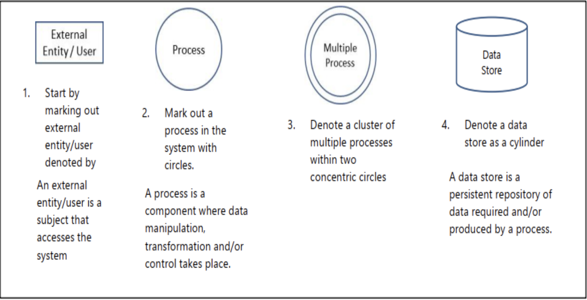

**Task B: Draw How Data Flows:**

Once Users have identified system components, Users should map out how the components communicate with one another, or provide some form of access to one another. With a completed DFD, Users will be able to visualize how data flows through the system and which components are involved, as shown below:

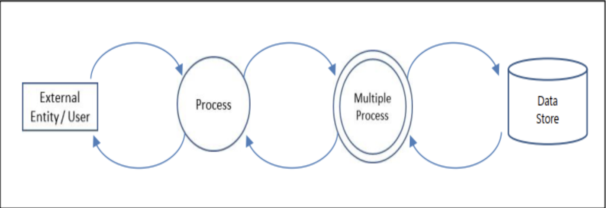

**Task C: Divide Out Trust Boundaries:**

- Trust boundaries are the boundaries that separate the components that are trusted from those that are not trusted. Trust boundaries are important as they help to identify the components that are exposed to the external environment and are prone to attack. Trust boundaries are usually drawn as a dotted line on the DFD. The components within the trust boundary are considered trusted, while those outside the trust boundary are considered untrusted. The trust boundary is usually drawn as a dotted line on the DFD. The components within the trust boundary are considered trusted, while those outside the trust boundary are considered untrusted.

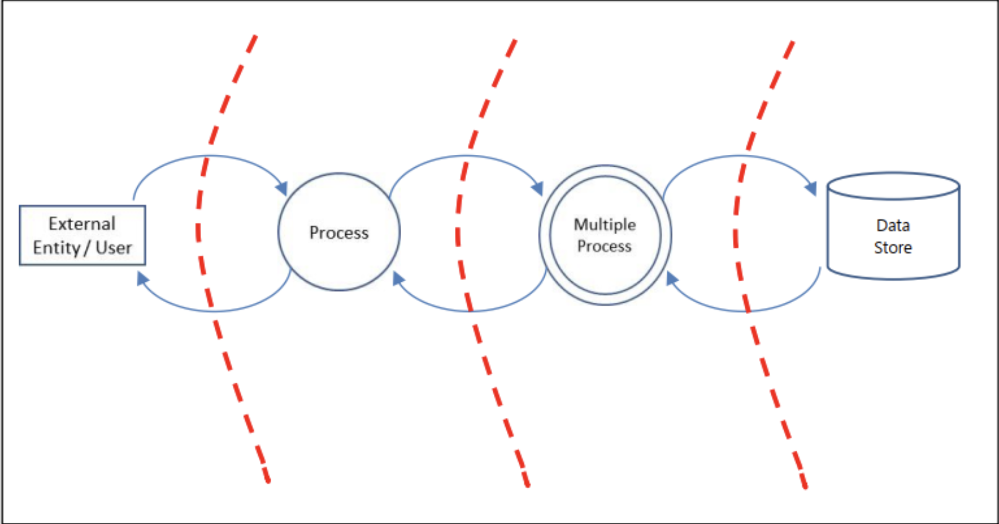

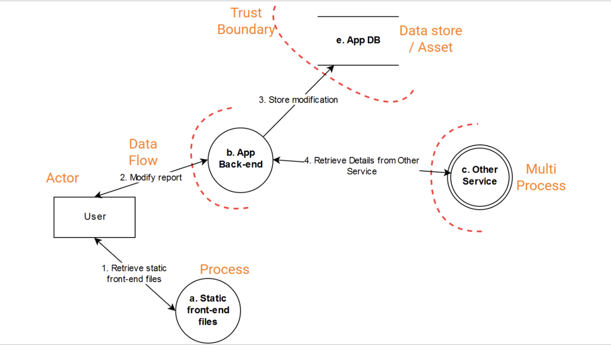

### Step 3: Threat Identification

- Threat identification is the process of identifying the threats that may affect the system. Threats are potential security violations that may result in damage to the system. Threats can be categorized into two types: internal and external. Internal threats are threats that originate from within the organization, while external threats are threats that originate from outside the organization. Threats can also be categorized into two types: intentional and unintentional. Intentional threats are threats that are caused by an attacker, while unintentional threats are threats that are caused by an accident or mistake. Threats can also be categorized into two types: internal and external. Internal threats are threats that originate from within the organization, while external threats are threats that originate from outside the organization. Threats can also be categorized into two types: intentional and unintentional. Intentional threats are threats that are caused by an attacker, while unintentional threats are threats that are caused by an accident or mistake.

Useful threat information typically has the following characteristics:
• `Timely` – Information should be received in a timely manner as information that is outdated is useless to Users;
• `Relevant` – Information needs to be relevant to the context of the Users. For example, industrial control systems may have different priorities compared to financial institutions; and
• `Actionable` – Information should be actionable for the correct group of users. Users must be able to react to information at the appropriate level e.g. tactical or strategic level.

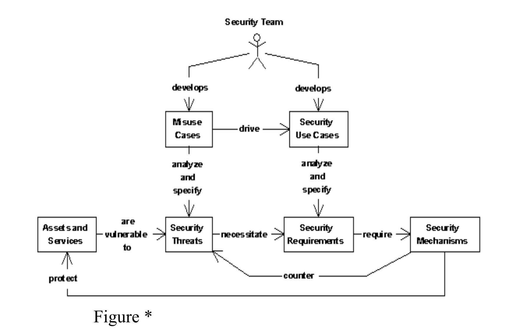

Figure *, misuse cases (a.k.a., abuse cases) are a specialized kind of use cases that are used to analyze and specify security threats. Unlike normal use cases that document interactions between an application and its users, misuse cases concentrate on interactions between the application and its misusers (e.g., cracker or disgruntled employee) who seek to violate its security. Because the success criteria for a misuse case is a successful attack against an application, misuse cases are highly effective ways of analyzing security threats but are inappropriate for the analysis and specification of security requirements. Instead, security use cases should be used to specify requirements that the application shall successfully protect itself from its relevant security threats.

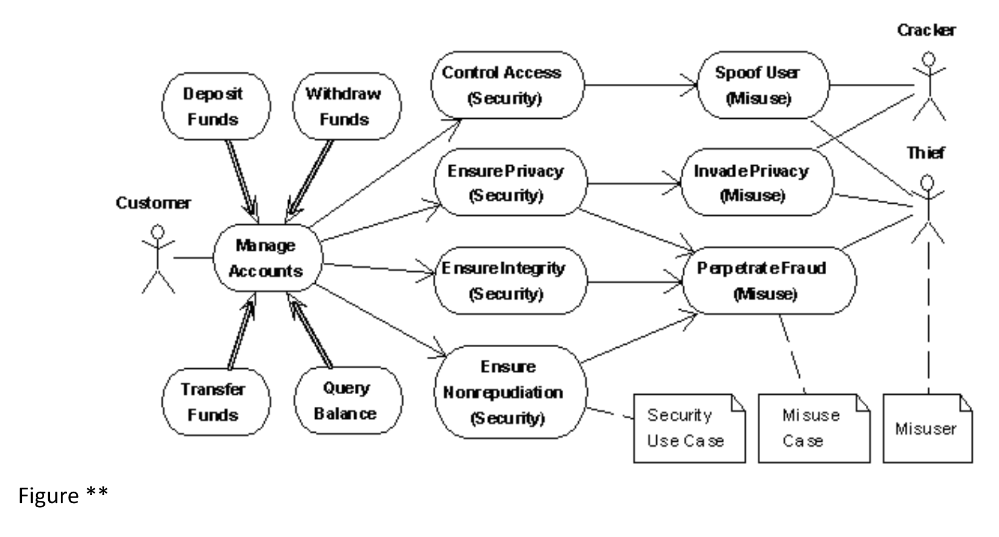

Figure**. The traditional use cases for an automated teller machine include Deposit Funds, Withdraw Funds, Transfer Funds, and Query Balance, all of which are specializations of a general Manage Accounts use case. To securely manage one’s accounts, one can specify security use cases to control access (identification, authentication, and authorization), ensure privacy (of data and communications), ensure integrity (of data and communications), and ensure nonrepudiation of transactions. The resulting four security use cases specify requirements that protect the ATM and its users from three security threats involving attacks by either crackers or thieves.

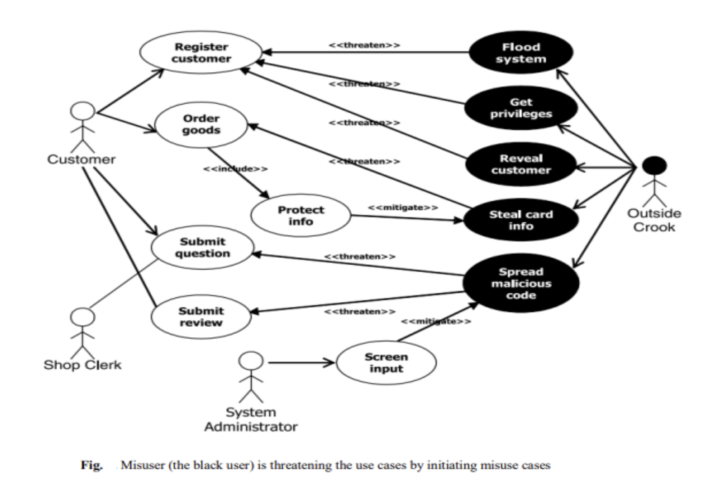

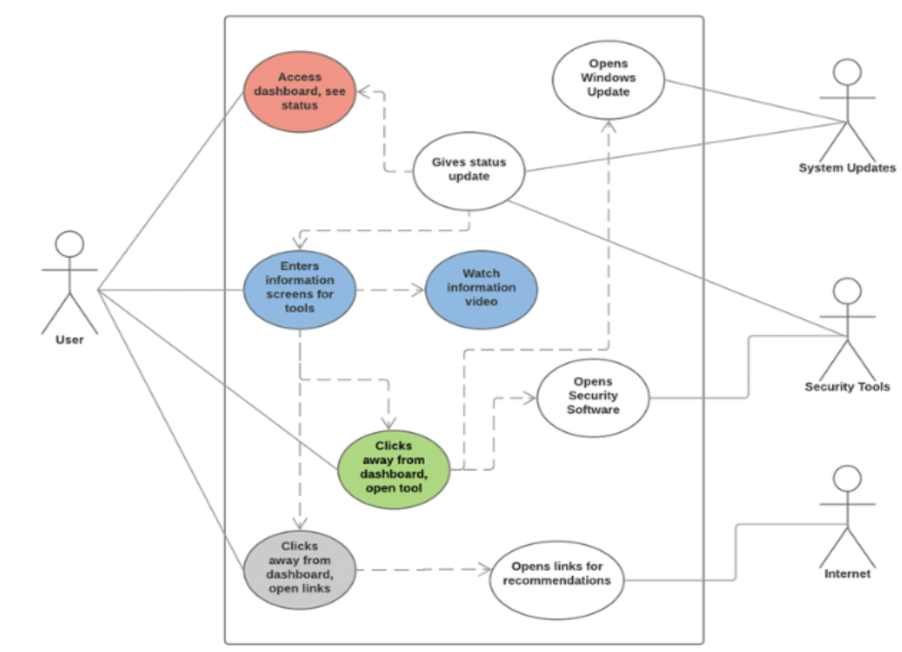
